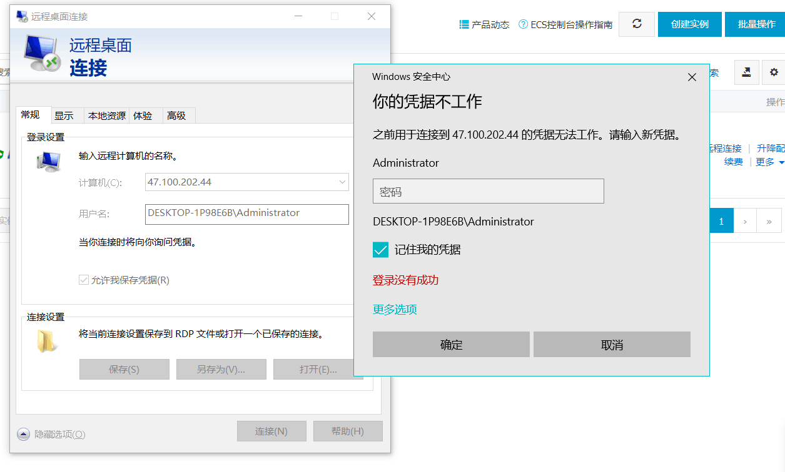
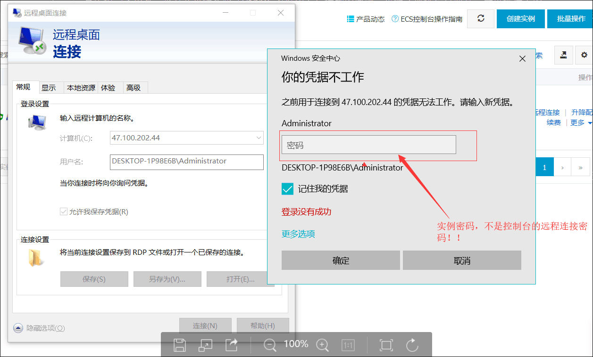
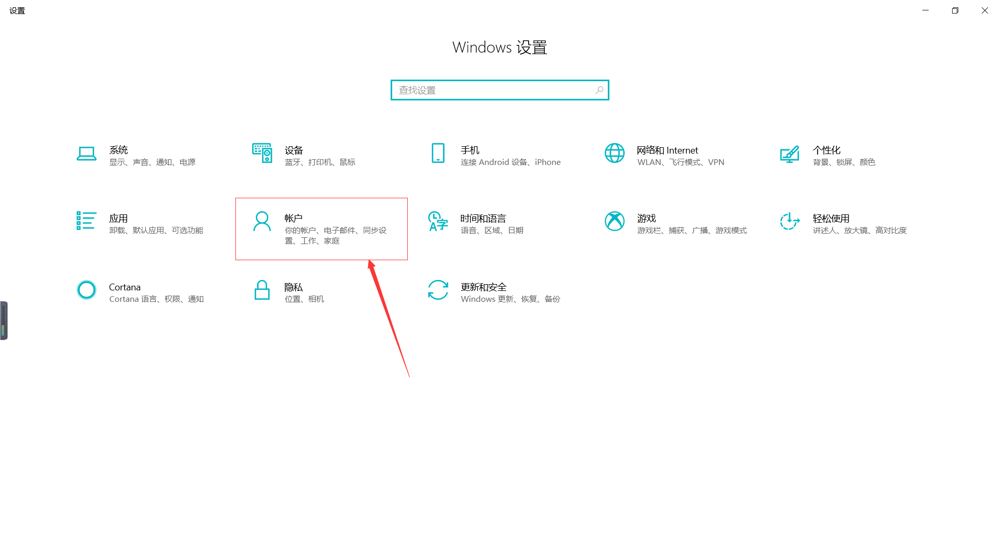
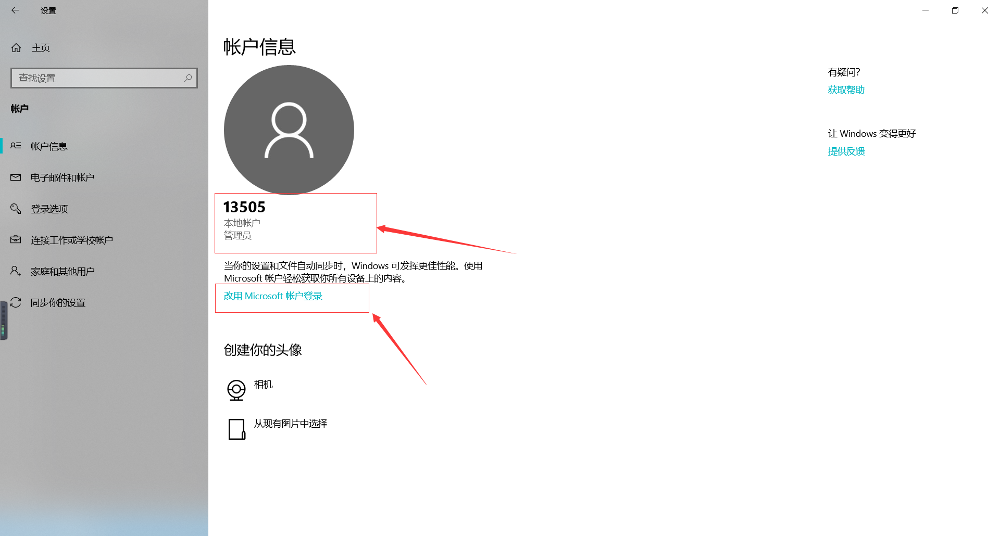
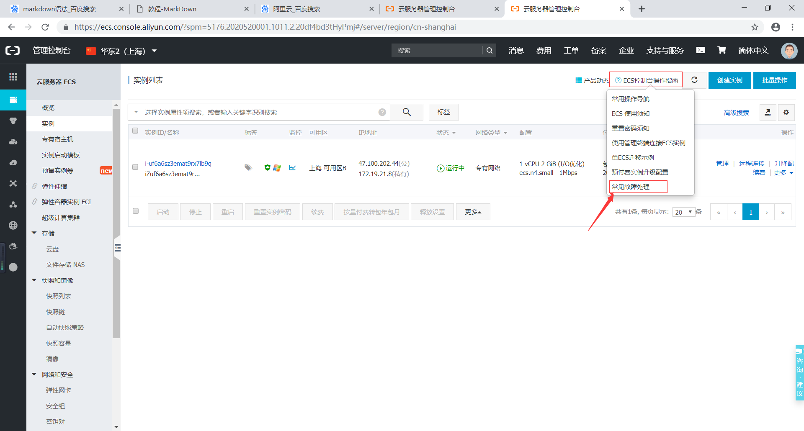

# 远程连接服务器（Ecs）走过的坑
  首先说一下由来，这是我重装系统（win10 家庭版）后遇到的问题。重装之前远程桌面是完全可连接上服务器的。
  还有就是，我虽然捣鼓好了，但是其中的原理究竟是为什么，我真的不知。而且，我用了很多方法，也不知道哪种方法起的作用。不过你可以跟着我试试。

  我不知道是win 10 家庭版不支持 远程协助 的问题，还是其他问题，关键是我确实是 升级到专业版了。

  win 10 家庭版 ，好像是支持远程协助别人，不支持远程协助自己。。（此处有待考察）

问题：远程连接很报错 ： **你的凭据不工作**
<!--  -->

如果你也是win 10 家庭版，可以按照以下顺序解决问题（一定要按照顺序）

1. 首先看看是不是你密码对不对。

服务器有两个密码：远程连接密码 和 实例密码（服务器的登录密码）。

远程连接密码可以从阿里云的控制台进入的你的服务器，进去之后，你还得输入实例密码（登录密码）（就像你登录自己的笔记本一样，也得输入pin码或 登录密码），才能正式进入。

切记： 远程桌面连接密码是你 __服务器的登录密码（也就是实例密码)__，不是控制台的远程连接密码！！！（如果我说的不清楚，你就两个密码都试试）

2. 用户，账户设置

  开始菜单 -> 设置 -> 账户

看你的是什么账户：本地账户 和 联网账户（Microsoft 账户登录）。

我之前是Microsoft 账户登录的，后来改成本地账户才好使。(你也可以反过来试试)

3. 组策略

首先说一下，win 10 家庭版是没有组策略的。你可以先是一下这个方法 ：
[click me](https://blog.csdn.net/DeMonliuhui/article/details/83180406) -
https://blog.csdn.net/DeMonliuhui/article/details/83180406

这个你参考这条连接就行了，我就是照着他做的。[click me](https://mk.mbd.baidu.com/7fv2quq?f=cp&u=3b314bbc9a168165) -
https://mk.mbd.baidu.com/7fv2quq?f=cp&u=3b314bbc9a168165

强调一点是地 5 步骤 命令 **"gpupdate /force" 有个空格！**

4. 查看阿里云的帮助文档

  你就慢慢看吧，有点复杂，关键是你也不知道用哪种方法。但是不试试，肯定好不了，因此不要怕麻烦！

  [click me](https://help.aliyun.com/knowledge_detail/50982.html?spm=a2c4g.11186631.2.1.5a2d78d8aZXVOK) -
  https://help.aliyun.com/knowledge_detail/50982.html?spm=a2c4g.11186631.2.1.5a2d78d8aZXVOK

  

5. 升级系统

我就是从win 10 家庭版 -> win 10 专业版

淘宝上有买密钥的，不贵。而且 淘宝卖家会教你，10分钟就好了。

升级完了，在尝试一下以上步骤，尤其是 组策略。

**********

好了我要说的内容，差不多了。要是还不好使，。。。那就接着捣鼓吧。 (*^_^*)

另外，我也是小白，写的不好之处（有可能有错误），多多包涵。
