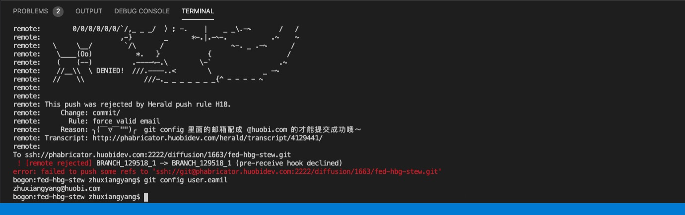

> 这里先临时存放，闲下来时在进行归类整理

## arc流程
`git commit -m` 任务完成之后

`arc diff -create origin/featurexxx `(注意这里不能少了 origin, 与线上的版本进行对比。)

完成之后，会自动创建diff请求, 并返回Revision地址，例如：Revision URI: http://phabricator.xxxxdev.com/D41544
如果diff没有通过，再次修改过后并提交（git commit过后 ）

`arc diff --update D(id)` id例如：D41544  （更新diff）

diff通过之后，执行
`arc land --onto origin develop` (land到远程分支上)

```
BRANCH_T105030：
    1. git fetch origin master (将远程master分支拉去下来，后续的命令用origin/master在本地表示远程master分支)
    2. git merge origin/master (在本地BRANCH_T105030分支合并origin/master分支，使BRANCH_T105030分支保持最新，并解决冲突)
    3. git tag PRD_T105030 （打签）
    4. git push （推送到远程仓库中，前提是该分支关联正确的远程分支，否则就推送到别的分支上了）
    5. git push --tags （git push origin --tags）
    
master:
    6. git merge BRANCH_T105030
    7. git push 
     
   
将远程仓库的分支拉取到本地（本地没有的） 
git fetch origin BRANCH_T105030
git checkout -b BRANCH_T105030 origin/BRANCH_T105030 (同时建立了追踪关系)

当在本地新建了一个分支，远程没有
第一次推送时：
git push --set-upstream origin BRANCH_XXX (推送到远端，并和远端建立起追踪关系)
git branch --set-upstream-to=origin/remote_branch  your_branch (这个命令挺好的吧)
```


## 关于git 的valid eamil, push不上去远端问题


大概是这样的，今早push代码，push不上远端，提示email格式不正确。一想格式确实不符合公司的邮箱的规范（config不是公司的邮箱，是我qq的邮箱）。
`git config --global user.email`
`git config user.email`

但是通过上面的命令改了好几次，依然push不上去。
咨询他人，原来是：git 每次`git commit`时，都会在commit这个版本上携带邮箱信息。因为我git commit了好多次（都是携带了qq邮箱的信息）。
因此要将代码回滚到 我第一次commit的**上一次**版本号。（也就是从远端迁出的那一次版本号）
`git reset --soft <版本号>` 将版本库中的修改回滚到暂存区  [git reset 详解](https://www.jianshu.com/p/c2ec5f06cf1a)

然后，再次`git commit -m""`,
在`git push`

## git 关于远端没有追踪分支的问题
大概是这样的，今天改一个bug,新建一个分支，修改完后，提交分支的时候。显示远程没有指定分支，提交不上去（忘记截图了）

我的提交流程大概是这样的：
```
git checkout -b BRANCH_T110 master  //因为我的本地master是最新的，我就想当然的没有基于远端master穿件本地分支。（git checkout -b BRANCH_T110 origin/master）
...
git push -u origin BRANCH_T110  //error，推送不上去
再试这个方法： git push origin <远程分支名>:<本地分支名>  //也推不上去

```

具体原因还不知道，但是通过`git branch -vv` 查看，你会发现`BRANCH_T110`与别的分支是不一样的，
它后面没有对用的远程分支名。

解决方法：
我把这个分支删掉了（因为我就修改了一个参数，改动比价少）
`git branch -D BRANCH_T110`  （不要在BRANCH_T110删除执行该命令，没有效果。换个分支，比如master）

然后在基于远端master创建了本地分支：
`git fetch origin master`
`git checkout -b BRANCH_T110 origin/master`   （其实这时，BRANCH_T110分支和origin/master分支是关联的，不信的话可以用g`it branch -vv`查看）
...
...
然后再push就可以了。
第一次push`git push -u orign BRANCH_T110`